# Soporte de kioskos de autoservicio con Claude — Skill + MCP server

Proyecto integrador (módulos 5, 6 y 7). Un par **Skill + servidor MCP** para el soporte de
**kioskos de autoservicio instalados en restaurantes cliente**. Convierte los avisos que llegan
de los locales ("¡el kiosko no cobra!", "no sale el ticket del pedido", "no enciende") en
tickets bien clasificados, priorizados según el contrato, vinculados a incidencias masivas y
sin datos de tarjeta dentro.

> Todos los clientes, locales, personas y kioskos son **ficticios** (dominios `.example`).

## 1. Caso de uso

Damos soporte a un parque de kioskos de autoservicio en cadenas de restauración: pantalla
táctil, datáfono (pinpad), impresora térmica del ticket de pedido e integración con la caja
(POS) y la pantalla de cocina (KDS). Los avisos llegan por WhatsApp, teléfono o correo, casi
siempre del encargado del local en plena hora de servicio y con prisa. El técnico tiene que
averiguar qué kiosko es, si está conectado, cuántos le quedan al local, si el restaurante está
abierto ahora, qué contrato tiene el cliente, si otros locales reportan lo mismo (una
actualización defectuosa puede tumbar los pagos de toda una cadena) y si el kiosko está todavía
en fase de **proyecto de despliegue** (entonces no es de soporte, sino del jefe de proyecto).
Además, es habitual que el encargado pegue el número de tarjeta de un cliente "para localizar
el cobro", lo que no puede acabar en el sistema de tickets (PCI-DSS).

Con este proyecto, el técnico pega el aviso en Claude Code. La **Skill `triage-kioskos`** guía
el proceso (hechos → telemetría y contexto del local → masivas → clasificar → proponer →
confirmar → respuesta al local), y el **servidor MCP `kioskos`** aporta los datos y aplica las
reglas de negocio de forma determinista: prioridad por matriz ITIL, suelo P2 en pagos y
seguridad, subida por contrato *gold*, derivación a *Proyectos y Despliegues* si el kiosko está
en instalación, validación de que quien reporta es un contacto autorizado **de ese cliente**,
redacción de tarjetas/CVV y aprobación humana obligatoria antes de escribir.

## 2. Arquitectura

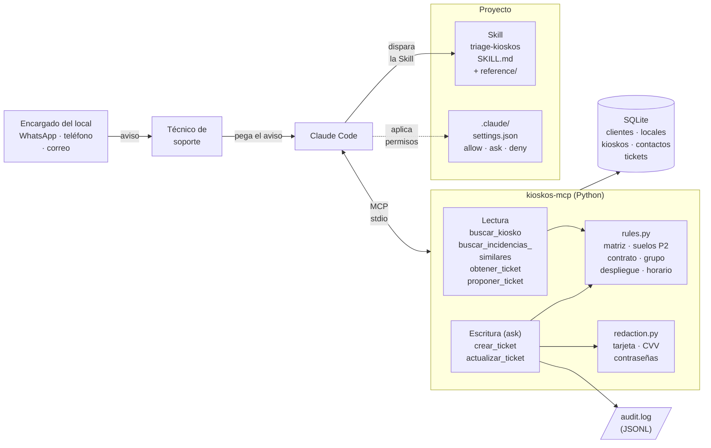

Versión texto:

```
 Encargado ─► Técnico ─► Claude Code ─(description)─► Skill triage-kioskos
                             │                         ├─ SKILL.md (flujo en 7 pasos)
                             │                         └─ reference/ (matriz, categorías, plantillas)
                             │ permisos: .claude/settings.json (allow lectura · ask escritura · deny)
                             ▼
                      MCP stdio ─► kioskos-mcp (Python / FastMCP)
                                    ├─ lectura:   buscar_kiosko · buscar_incidencias_similares
                                    │             obtener_ticket · proponer_ticket
                                    ├─ escritura: crear_ticket · actualizar_ticket ─► audit.log
                                    ├─ rules.py · redaction.py
                                    ▼
                             SQLite: clientes ─< locales ─< kioskos (telemetría)
                                     contactos (por cliente/local) · tickets · comentarios
```

**Flujo de la Skill y uso del MCP:**

| Paso | Qué hace | Tool MCP | Permiso |
|---|---|---|---|
| 1 | Extrae quién reporta, qué kiosko, síntoma, efecto en el servicio | — | — |
| 2 | Telemetría (online, minutos sin conexión), kioskos del local, horario, contrato, despliegue | `buscar_kiosko` | auto |
| 3 | Masivas en todo el parque: locales y **versiones de software** afectadas | `buscar_incidencias_similares` / `obtener_ticket` | auto |
| 4 | Clasifica con `reference/` (categoría, impacto, urgencia) | — | — |
| 5 | Simula: el servidor calcula prioridad, SLA y grupo | `proponer_ticket` | auto |
| 6 | Muestra la propuesta y espera un "sí" | `crear_ticket` | **pide confirmación** |
| 7 | ID + respuesta para el encargado + siguiente acción interna | (`actualizar_ticket`) | **pide confirmación** |

**Reglas de negocio (en el servidor, no en el modelo):**

| Regla | Efecto |
|---|---|
| Matriz ITIL impacto × urgencia | P1…P4 |
| `pago_tpv` o `seguridad` | Nunca por debajo de P2 |
| Cliente con contrato **gold** | Sube un nivel (hasta P2) |
| Kiosko o local **en despliegue** | Grupo *Proyectos y Despliegues* |
| Solicitante | Debe ser interno o **contacto registrado del mismo cliente** que el kiosko |

## 3. Instrucciones de uso paso a paso

Requisitos: Python ≥ 3.10, [Claude Code](https://docs.claude.com/en/docs/claude-code) y Git.
Comandos para **Windows / PowerShell** (Linux/macOS en `mcp-server/README.md`).

1. **Descomprime** el ZIP (o clona el repo) y entra en la carpeta:
   ```powershell
   cd soporte-kioskos
   ```
2. **Instala el servidor MCP** en un entorno virtual (el `pip install` se lanza **desde
   dentro de `mcp-server`**):
   ```powershell
   python -m venv mcp-server\.venv
   .\mcp-server\.venv\Scripts\Activate.ps1
   cd mcp-server
   pip install -r requirements.txt
   cd ..
   ```
3. **Inicializa los datos de demo** (opcional; se hace solo al primer uso):
   ```powershell
   kioskos-mcp --init
   ```
4. **Comprueba el servidor** sin Claude (opcional):
   ```powershell
   cd mcp-server; pip install -r requirements-dev.txt; pytest -q; python scripts\demo_client.py; cd ..
   ```
5. **Abre Claude Code en la raíz del proyecto** con el entorno virtual activado:
   ```powershell
   claude
   ```
   La primera vez, acepta la confianza en la carpeta.
6. **Verifica**: `/mcp` → `kioskos` **connected** con 6 tools; pregunta "¿qué skills tienes
   disponibles?" → aparece `triage-kioskos`.
7. **Úsalo** pegando un aviso tal cual, por ejemplo:
   > Llama Lucía Romero, encargada de Wok & Go Sevilla Nervión (sevilla.nervion@wokandgo.example):
   > "El kiosko no enciende desde que abrimos, pantalla negra. Es el único que tenemos." Haz el triage.
8. **Revisa la propuesta** (prioridad, reglas, grupo, SLA, ticket padre) y responde "sí".
   Claude Code mostrará el diálogo de permiso de `crear_ticket`: acéptalo.
9. Más avisos para probar:

   | Mensaje | Resultado esperado |
   |---|---|
   | Elena (encargada.ruzafa@parrillaurbana.example): "El kiosko 2 da *Error de comunicación con TPV*, ha cobrado 18,40 y no salió el ticket" | Masiva de pagos en 2 locales, todos v4.2.1 → vincula a INC-000001 |
   | Rocío (apertura.malaga@cafemediterraneo.example): "El pinpad del kiosko 1 no empareja, abrimos el lunes" | Kiosko en despliegue → *Proyectos y Despliegues* |
   | Marc (diagonal@wokandgo.example): "En el kiosko de Gran Vía no sale el ticket" | Rechazo: contacto de otro cliente |
   | Iñaki (encargado.indautxu@parrillaurbana.example): "El datáfono tiene una pieza pegada que no había antes" | `seguridad` → mínimo P2, instrucciones de no tocar |
   | "Wok & Go pide presupuesto para 3 kioskos más" | **No** activa la Skill (anti-trigger) |

Para **resetear la demo**, borra la carpeta `%USERPROFILE%\.kioskos-mcp`.

### 3.1 Configuración (opcional: la demo funciona sin tocar nada)

Toda la configuración está en tres ficheros de texto. **Ninguno contiene contraseñas ni
claves**: el servidor no las necesita.

| Fichero | Para qué sirve |
|---|---|
| `.mcp.json` | Cómo arranca Claude Code el servidor y con qué variables |
| `.claude/settings.json` | Qué se usa sin preguntar, qué pide permiso y qué está prohibido |
| `mcp-server/.env.example` | Referencia de todas las variables y sus valores por defecto |

**Paso 1 — Abre `.mcp.json`** (Bloc de notas o VS Code). Verás el bloque `env`:

```json
"env": {
  "KIOSKOS_INTERNAL_DOMAINS": "empresa.example",
  "KIOSKOS_READ_ONLY": "false",
  "KIOSKOS_ACTOR": "claude-code",
  "KIOSKOS_TZ": "Europe/Madrid"
}
```

**Paso 2 — Ajusta solo lo que necesites:**

| Quiero… | Cambia | Ejemplo |
|---|---|---|
| Que mis técnicos puedan abrir tickets en cualquier cliente | `KIOSKOS_INTERNAL_DOMAINS` | `"miempresa.com"` |
| Que Claude solo pueda consultar, nunca escribir | `KIOSKOS_READ_ONLY` | `"true"` |
| Identificar quién escribe en el historial | `KIOSKOS_ACTOR` | `"soporte-n1-turno-tarde"` |
| Guardar los datos en otra carpeta | añade `KIOSKOS_DATA_DIR` | `"C:/Datos/kioskos"` |
| Calcular el horario de servicio en otra zona | `KIOSKOS_TZ` | `"Atlantic/Canary"` |

> Los contactos de los clientes (encargados, operaciones) no se configuran aquí: están en la
> tabla `contactos` (datos de demo en `mcp-server/src/kioskos_mcp/seed/parque.json`).

**Paso 3 — Revisa los permisos** en `.claude/settings.json` (recomendado dejarlos así):
- `allow`: la Skill `triage-kioskos` y las 4 tools de lectura → no preguntan.
- `ask`: `crear_ticket` y `actualizar_ticket` → **siempre** piden confirmación.
- `deny`: leer `.env` o la base de datos directamente, `sqlite3`, `rm`, `curl`, `git push`,
  editar las reglas de negocio o el propio `settings.json`…

**Paso 4 — Aplica los cambios:** cierra Claude Code (`/exit`) y vuelve a abrirlo con `claude`.
El servidor lee la configuración solo al arrancar.

**Paso 5 — Comprueba:** `/mcp` → `kioskos` **connected**. Si aparece **failed**, lo más
habitual es que el entorno virtual no esté activado (`Activate.ps1`) antes de lanzar `claude`.

Para adaptarlo a tu parque real, los puntos de cambio son `seed/parque.json` (clientes,
locales, kioskos, contactos) y `rules.py` (matriz, SLA, grupos); detalle en
[`mcp-server/README.md`](mcp-server/README.md).

## 4. Demo: transcripts de sesiones reales

| Fichero | Qué contiene |
|---|---|
| [`docs/transcript-claude-code.md`](docs/transcript-claude-code.md) | Sesiones reales de **Claude Code 2.1.285**: (1) error de pago con cobro sin pedido → la Skill se carga, lee `reference/`, detecta la masiva de la v4.2.1 en 2 locales, no copia la tarjeta, la escritura queda bloqueada hasta la aprobación humana y se crea INC-000008 P1; (2) kiosko único apagado en hora punta → P1 con workaround; (3) anti-trigger de presupuesto; (4) **hallazgos de las pruebas y cómo se corrigieron**. |
| [`docs/transcript-mcp.md`](docs/transcript-mcp.md) | Cliente MCP ↔ servidor por stdio: los dos casos completos, idempotencia, redacción de la tarjeta y 4 rechazos (contacto desconocido, contacto de otro cliente, reabrir un cerrado, categoría inválida). |

### 4.1 Capturas de la sesión en Windows 11 (PC del autor)

Ejecución completa en Windows 11 · Python 3.13 · Claude Code 2.1.284 · consola CMD.

| # | Qué demuestra | Captura |
|---|---|---|
| 1 | Instalación reproducible: **19 tests** superados | 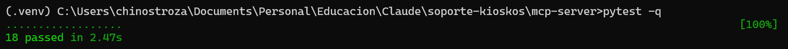 |
| 2 | Cliente MCP real por stdio: 2 casos y log de auditoría | 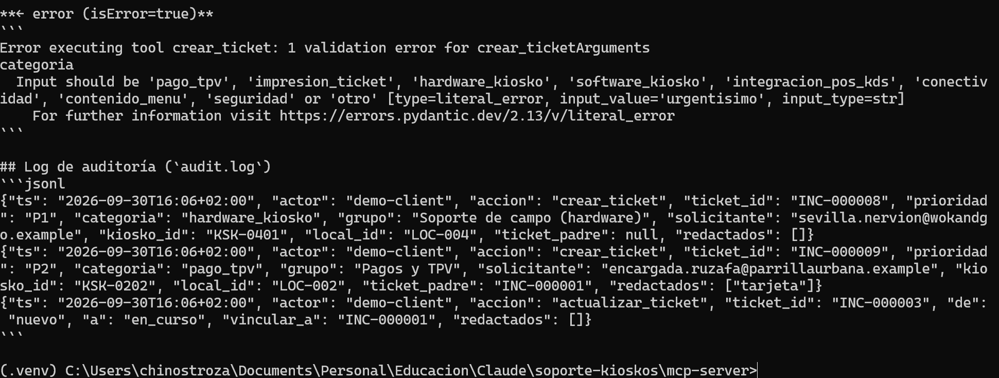 |
| 3 | `settings.json` pre-aprueba **solo** lectura + Skill; las escrituras no aparecen | 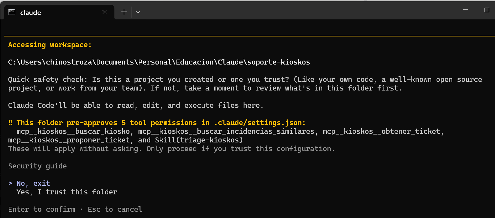 |
| 4 | Claude Code conecta el servidor `kioskos` desde `.mcp.json` (6 tools) | 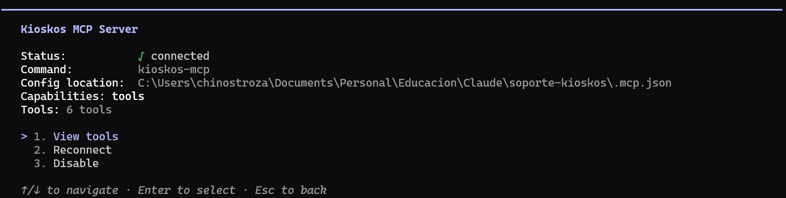 |
| 5 | Triage del error de pago: horario, masiva v4.2.1 en 2 locales, P2, sin copiar la tarjeta | 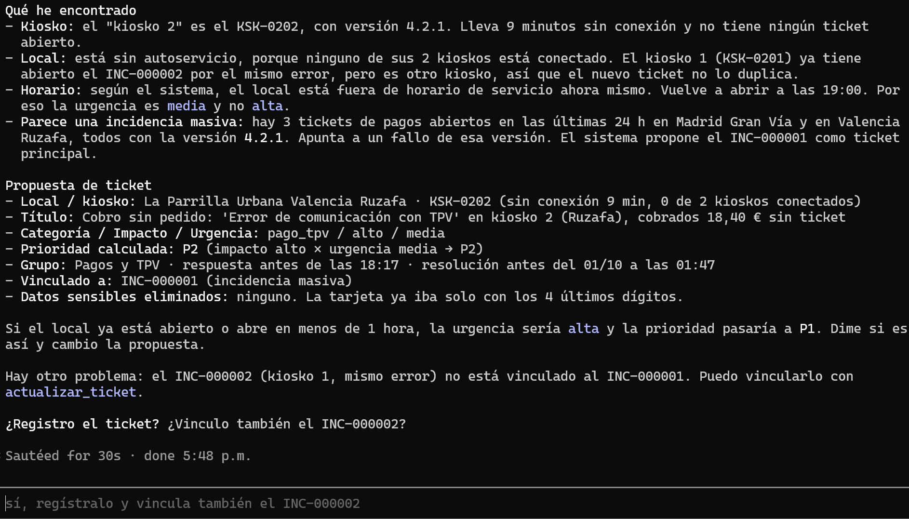 |
| 6 | Regla `ask`: `crear_ticket` pide aprobación **incluso en modo auto**; tarjeta solo con 4 últimos dígitos | 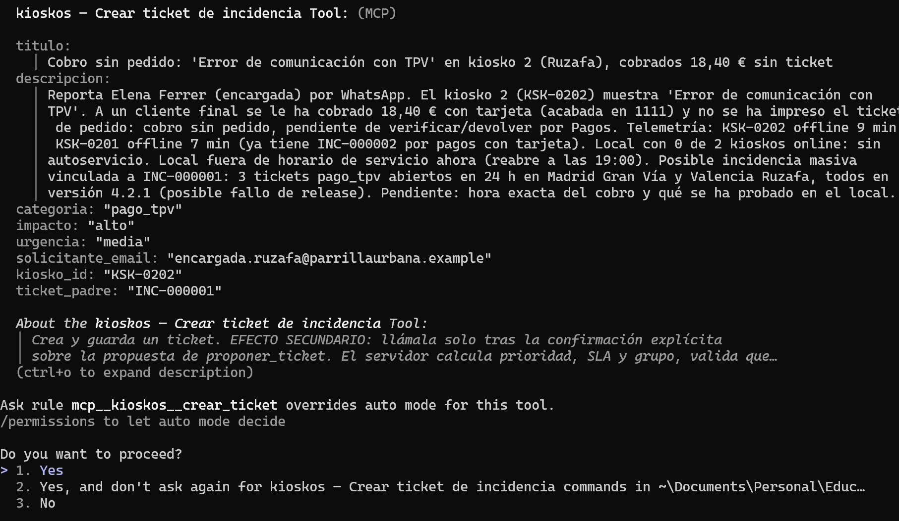 |
| 7 | Regla `ask` también en `actualizar_ticket` (vincular a la masiva) | 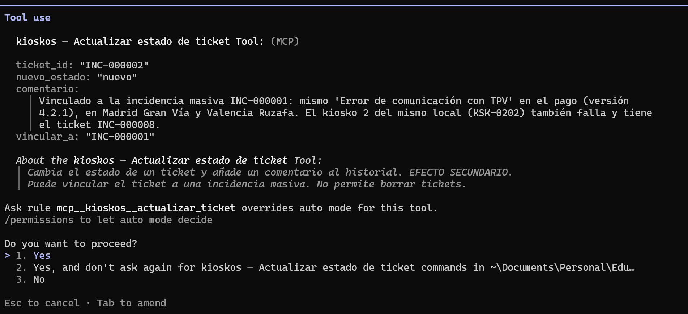 |
| 8 | Ticket **INC-000008** creado + siguientes pasos internos | 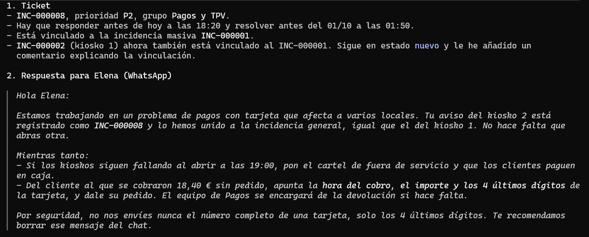 |
| 9 | Kiosko único apagado: telemetría 95 min, 0/1 online; Claude detecta que el horario registrado contradice el aviso y lo justifica | 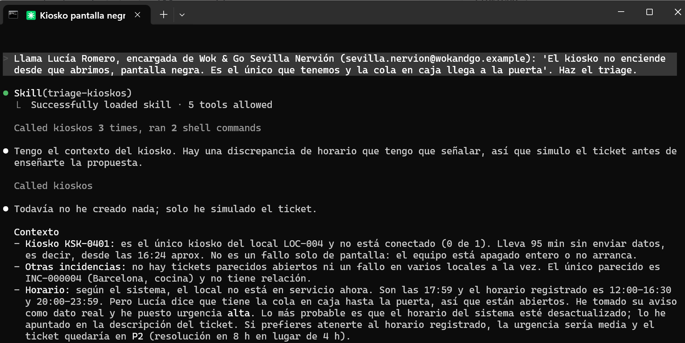 |
| 10 | **Anti-trigger**: un presupuesto no activa la Skill ni crea tickets | 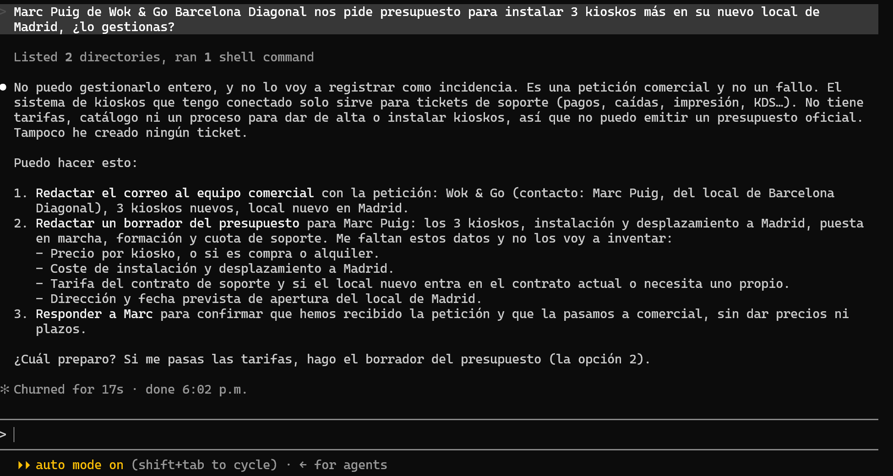 |

Extracto (respuesta real de Claude en el caso 1):

> **Por qué impacto alto:** hay 3 tickets de pago abiertos en 24 h en 2 locales (Madrid Gran
> Vía y Valencia Ruzafa). Todos están en la versión 4.2.1, lo que apunta a un fallo de release.
> […] **Tarjeta del cliente:** Elena ha enviado el número completo de la tarjeta por WhatsApp.
> Conviene pedirle que borre ese mensaje […]. ¿Lo registro?

## 5. Seguridad

| Capa | Medida |
|---|---|
| **Permisos de Claude Code** (`.claude/settings.json`) | `allow` solo para la Skill y las 4 tools de lectura · `ask` para `crear_ticket` y `actualizar_ticket` (probado: ni `bypassPermissions` lo salta) · `deny` para leer `.env` o la base de datos, `sqlite3`, `curl`, `wget`, `rm`, `git push`, `WebFetch` y editar `rules.py`, `redaction.py` o `settings.json` |
| **Skill** (`allowed-tools`) | Pre-autoriza solo lectura; las tools con efectos secundarios quedan fuera a propósito. Instruye a no copiar datos de tarjeta |
| **Servidor MCP** | Sin secretos (todo por variables de entorno) · schemas estrictos (enums, regex de ids, longitudes) · **solo contactos registrados**, y **aislados por cliente** · redacción de tarjeta, CVV, contraseñas, tokens e IBAN (PCI-DSS) · modo solo lectura · máquina de estados · SQL parametrizado · sin tool de borrado · auditoría JSONL · stdio (sin puertos abiertos) |
| **Repositorio** | `.gitignore` excluye `.env`, `*.db`, `audit.log`, `settings.local.json`; datos 100 % ficticios |

## 6. Limitaciones conocidas

- **Datos ficticios y SQLite local.** No está conectado al ITSM real ni a la plataforma de
  telemetría de los kioskos. En producción, `service.py` se sustituiría por clientes de sus
  APIs manteniendo las mismas tools y schemas.
- **Telemetría simulada**: en la demo cada kiosko tiene unos "minutos sin conexión" fijos
  (`demo_min_sin_conexion`), para que se vea igual hoy o dentro de un mes. En producción ese
  campo va vacío y se usa `ultima_conexion`, que enviaría la plataforma de monitorización.
- **Similitud por palabras clave** (raíces de 6 letras + categoría), no semántica.
- **Horario de servicio simplificado**: mismo horario todos los días, sin festivos ni tramos
  que crucen la medianoche; SLA en horas naturales.
- **Umbral de masiva fijo** (3 similares abiertas en 24 h).
- **Redacción por expresiones regulares**: cubre tarjetas, CVV y credenciales habituales, pero
  no es un DLP completo.
- **Sin autenticación del técnico**: el servidor confía en quien lo lanza (stdio local); la
  validación de contactos protege frente a solicitantes, no frente al operador.
- **Zona horaria única** para todos los locales (`KIOSKOS_TZ`); no sirve tal cual para un
  parque en varios husos (p. ej. Canarias).
- `kioskos-mcp` debe estar en el `PATH` (entorno virtual activado) al abrir Claude Code.

## 7. Estructura de la entrega

```
soporte-kioskos/
├── README.md                         ← este documento
├── .mcp.json                         ← registra el servidor "kioskos"
├── .gitignore
├── .claude/
│   ├── settings.json                 ← permisos allow / ask / deny
│   └── skills/triage-kioskos/
│       ├── SKILL.md                  ← frontmatter + flujo + ejemplos
│       └── reference/
│           ├── matriz-prioridad.md
│           ├── categorias.md
│           └── plantillas-respuesta.md
├── mcp-server/                       ← ver mcp-server/README.md
│   ├── README.md · pyproject.toml · requirements*.txt · .env.example
│   ├── src/kioskos_mcp/ (server, service, rules, redaction, models, config, seed/)
│   ├── tests/ (19 tests) · scripts/demo_client.py
└── docs/
    ├── transcript-claude-code.md
    ├── transcript-mcp.md
    └── publicar-en-github.md
```

## 8. Correspondencia con los criterios de evaluación

| Criterio | Dónde verlo |
|---|---|
| Funcionalidad real (40 %) | 6 tools sobre SQLite con telemetría y contexto de local · 19 tests · sesiones reales de Claude Code (en Linux y en Windows) y del cliente MCP · 3 fallos encontrados en pruebas reales y corregidos |
| Calidad de la `description` (15 %) | `SKILL.md`: síntomas concretos del sector como disparadores + 7 exclusiones (presupuestos, aperturas, cambios de carta…); anti-trigger probado |
| Diseño de tools (15 %) | Lectura/escritura separadas (`proponer` vs `crear`), enums de dominio, regex de ids, salida estructurada, anotaciones, errores accionables, idempotencia, contexto calculado (online, en horario, kioskos del local, versiones afectadas) |
| Documentación (15 %) | Este README, `mcp-server/README.md`, `reference/`, transcripts |
| Seguridad (15 %) | Sección 5: permisos en 3 capas, PCI (tarjeta/CVV), aislamiento entre clientes, auditoría, sin secretos |
